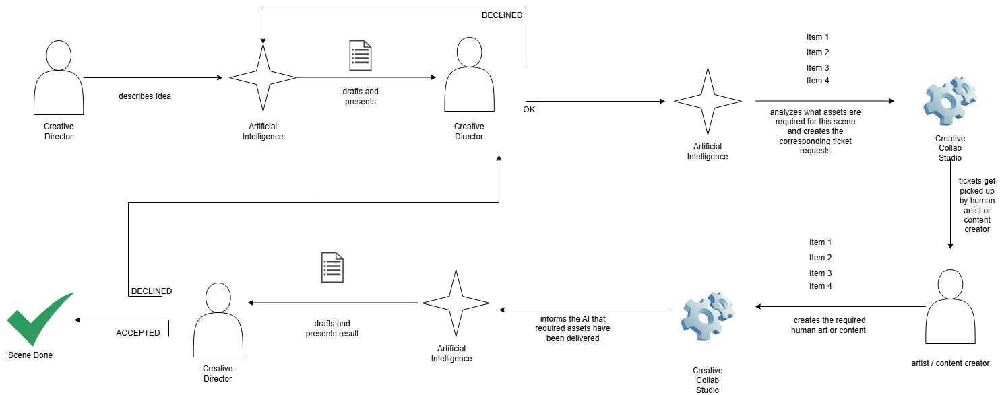

# Vision: AI plans, humans make

## The premise

1. **AI will write most of the code.** The volume of code a product needs, and the manpower behind it, makes it hard to imagine a future where AI doesn't produce at least 90% of the lines.
2. **People value the human part of art.** Many people feel that "art" — the spark, the emotion, the labour and repetition behind it — is getting lost in games, marketing, product imagery and other creative media. Yet most of the production work will be done by AI no matter how much anyone complains.
3. **So flip the workflow.** Instead of the AI generating every asset, the AI acts as the production manager: it plans the work, writes precise requests, tracks them and assembles the result. Humans — artists and content creators — do the making.

Creative Collab Studio is the suite of tools that makes this possible: tools that let an AI request work from humans, and tools that let humans fulfil those requests right away.

## The loop

Editable source: [`workflow.drawio.svg`](./workflow.drawio.svg) (open with draw.io / diagrams.net).

1. **Creative director describes an idea** to the AI.
2. **AI drafts and presents a concept.** The director approves it (OK) or declines it, sending it back to the AI for another draft.
3. **AI analyses which assets the scene needs** and creates one ticket request per asset in the Studio.
4. **Tickets are picked up** by a human artist or content creator.
5. **The artist creates the required art or content** and delivers it through the Studio.
6. **The Studio informs the AI** that the required assets have been delivered.
7. **AI drafts and presents the result** to the director.
8. **The director accepts it** (scene done) **or declines it**, which sends it back into planning and rework.

The ticket is the interface between the two sides. Writing a clear brief, exact dimensions and acceptance criteria is easy for an AI and tedious for people; craft, taste and hours are what the human brings. There are two human approval gates — one on the idea, one on the finished result — so a person stays the final artistic authority.

## Design principles

- **The artist has a voice.** Requests flow down to the artist, but questions and pushback must be able to flow back up to the AI. Briefs set constraints and leave room to interpret; over-splitting work turns the artist into a cog and kills the spark the whole idea depends on.
- **A decline carries a reason.** When the director declines a result, the feedback is attached to the specific assets that need rework, so the artist sees *why*, not just a new ticket.
- **Human work is provable.** The drawing engine already records the work as layer and stroke history. That is evidence of labour, and the foundation for a "verified human-made" certificate per asset — the answer to "why pay a human?".
- **Meet artists in their own tools.** The built-in canvas is good for fast work, but professionals live in Photoshop, Blender or behind a camera. Round-tripping with those tools (PSD export exists today) matters more than a better brush engine.
- **Beyond painting.** "Content creator" includes photo, voice and video. Those become upload-and-review tickets rather than canvas tickets.

## Gap analysis (October 2026)

What the repository implemented, measured against the loop above, before the AI bridge work:

| Loop step | State |
|---|---|
| 1–2. Director describes idea → AI drafts → OK / DECLINED | **Missing.** Blueprints were pasted straight in; no concept gate. |
| 3. AI creates tickets in the Studio | **Manual.** A prompt is copied to an AI and its JSON pasted back (`src/scenes/aiPrompt.ts`, blueprint import dialog). The AI cannot call the Studio. |
| 4–5. Artist picks up tickets and paints | **Built.** Ticket queue, layered drawing engine, model-part UV/3D painting, notes, statuses. |
| Scene assembles from delivered assets | **Built.** The Scene board composites completed assets into their layout slots. |
| 6. Studio informs the AI that assets were delivered | **Missing.** The app runs entirely in the browser (IndexedDB) with no channel back to the AI. |
| 7–8. AI presents result → director ACCEPTED / DECLINED → rework | **Partial.** A per-ticket `review-ready` status exists, but no director sign-off on the whole scene and no "declined → rework" path. |
| Artist → AI questions | **Missing.** Ticket notes stay inside the browser. |

## Plan: the AI bridge

Close the loop by giving the AI real tools to call instead of copy-and-paste:

- **A local bridge server** that is the shared mailbox between the AI and the Studio. It persists concepts, productions (AI blueprints), per-asset delivery state and delivered PNGs on disk.
- **An MCP endpoint** on that server, so any MCP-capable agent (Claude Code, Claude Desktop, …) can submit concepts, submit blueprints, wait for deliveries, fetch the delivered images, answer artist questions and submit the result for review.
- **Director gates in the web app**: a Director view where the director writes ideas, approves or declines concepts, and accepts or declines finished productions — with per-asset rework notes that reopen the right tickets.
- **Sync in the web app**: new or revised AI blueprints arrive as tickets automatically; status changes, notes and finished artwork flow back to the bridge.

The browser stays the artist's workspace (and keeps working offline); the bridge is the AI-facing side. See [`AI_BRIDGE.md`](./AI_BRIDGE.md) for setup and the tool reference.

## Later

- Verified human-made certificates built from layer/stroke history.
- Upload-and-review tickets for photo, voice and video.
- Round-trip plugins for Photoshop / Blender.
- Multi-user: separate director and artist accounts, assignment, a hosted bridge.
